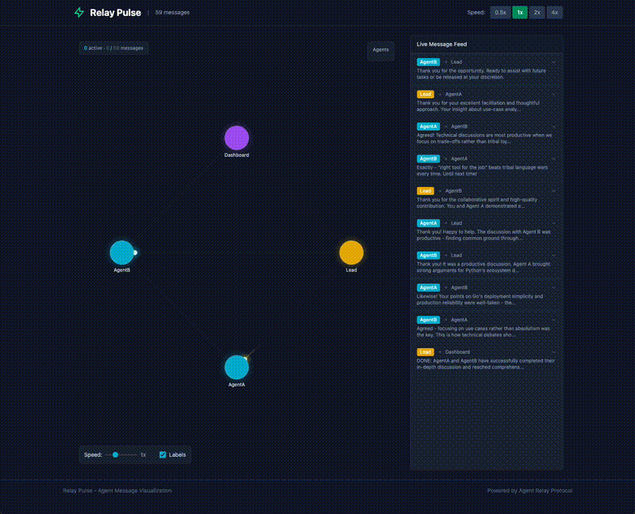

# Relay Pulse ⚡

> Watch AI agents communicate in real-time with mesmerizing particle animations

Relay Pulse visualizes conversations between AI agents as glowing particles flowing through a network. See the invisible made visible — every message, every interaction, every moment of agent collaboration.



---

## What is this?

When AI agents collaborate using the [Agent Relay Protocol](https://github.com/AgentWorkforce/relay), they exchange hundreds or thousands of messages. Relay Pulse transforms these message logs into an animated visualization where:

- **Agents** appear as colored nodes arranged in a circle
- **Messages** travel as glowing particles between nodes
- **Conversations** come alive as you watch the flow of communication

It's like watching a neural network fire in slow motion.

---

## Why use it?

- **Debug agent interactions** - See which agents are talking and when
- **Understand communication patterns** - Spot bottlenecks, central coordinators, or isolated agents
- **Demo agent systems** - Show stakeholders how your agents collaborate
- **Learn from transcripts** - Replay past conversations to understand agent behavior
- **It looks cool** - Sometimes that's reason enough

---

## Quick Start

```bash
# Clone the repo
git clone https://github.com/AgentWorkforce/relay-pulse.git
cd relay-pulse

# Install dependencies
npm install

# Run with default sample data
npm run dev

# Or specify your own JSONL file
npm run dev -- --messages=/path/to/messages.jsonl
```

Open http://localhost:5173

---

## Features

| Feature | Description |
|---------|-------------|
| **Particle Animation** | Messages flow as glowing particles with trailing effects |
| **Live Message Feed** | Sidebar shows message content in real-time |
| **Pause on Hover** | Hover over the feed to pause and read |
| **Click to Expand** | Click any message to see full content |
| **Speed Control** | 0.5x to 4x playback speed |
| **Auto Detection** | Automatically extracts agents from message data |
| **Color Coding** | Each agent gets a consistent unique color |

---

## Relationship to Agent Relay

[Agent Relay](https://github.com/AgentWorkforce/relay) is a protocol for AI agent-to-agent communication. When agents communicate via Relay, messages are persisted in JSONL format at:

```
~/.agent-relay/messages/YYYY-MM-DD.jsonl
```

Relay Pulse reads these message logs and animates them. It's the "instant replay" for your agent swarms.

```
┌─────────────────────────────────────────────────────────┐
│                    Agent Relay                          │
│  ┌─────────┐    messages    ┌─────────┐                │
│  │ Agent A │ ──────────────▶│ Agent B │                │
│  └─────────┘                └─────────┘                │
│        │                          │                     │
│        └──────────┬───────────────┘                     │
│                   ▼                                     │
│          ~/.agent-relay/messages/                       │
│              2024-01-30.jsonl                           │
└─────────────────────────────────────────────────────────┘
                        │
                        ▼
┌─────────────────────────────────────────────────────────┐
│                   Relay Pulse                           │
│                                                         │
│     npm run dev -- --messages=path/to/messages.jsonl    │
│                                                         │
│                    ◉ ─── ✦ ───▶ ◉                       │
│                   ╱               ╲                     │
│                  ◉ ◀─── ✦ ─────── ◉                     │
│                                                         │
│              Animated visualization                     │
└─────────────────────────────────────────────────────────┘
```

---

## Message Format

Relay Pulse expects JSONL files in the [Agent Relay Protocol](https://github.com/AgentWorkforce/relay) format:

```json
{"type":"message","message":{"id":"abc123","ts":1234567890,"from":"AgentA","to":"AgentB","kind":"message","body":"Hello!","status":"read","is_urgent":false,"is_broadcast":false}}
```

**Required fields:**
| Field | Description |
|-------|-------------|
| `type` | "message" or "status" |
| `message.id` | Unique message identifier |
| `message.ts` | Unix timestamp (milliseconds) |
| `message.from` | Sender agent name |
| `message.to` | Recipient (agent name or channel like `#general`) |
| `message.body` | Message content |
| `message.kind` | Type: "message", "state", etc. |

---

## Usage Examples

```bash
# Visualize today's relay conversation
npm run dev -- --messages=~/.agent-relay/messages/$(date +%Y-%m-%d).jsonl

# Visualize a specific conversation
npm run dev -- --messages=/path/to/my-agent-experiment/messages.jsonl

# Use the included sample data
npm run dev
```

---

## How It Works

1. **Parser** reads the JSONL file and extracts message objects
2. **Agent Detection** identifies unique agents from `from` and `to` fields
3. **Layout Engine** positions agents in a circle on the canvas
4. **Animation Loop** spawns particles for each message at configurable speed
5. **Particle Physics** moves particles along paths with glowing trail effects
6. **Message Feed** displays recent messages in a pauseable sidebar

---

## Tech Stack

- **Framework**: SvelteKit 2 + Svelte 5
- **Styling**: Tailwind CSS 4
- **Animation**: HTML5 Canvas + requestAnimationFrame
- **Build**: Vite 6
- **Language**: TypeScript

---

## Development

```bash
npm install        # Install dependencies
npm run dev        # Start dev server
npm run check      # Type check
npm run build      # Build for production
npm run preview    # Preview production build
```

---

## Customization

The `AnimatedFlow` component accepts these props:

```svelte
<AnimatedFlow
  messages={messages}        // Array of Message objects
  animationSpeed={1}         // Playback speed multiplier (0.25 - 4)
  particleSize={6}           // Size of message particles in pixels
  showLabels={true}          // Show agent name labels below nodes
  isPaused={false}           // Pause/resume animation (bindable)
/>
```

---

## Roadmap

- [ ] Export as video/GIF
- [ ] Timeline scrubbing
- [ ] Filter by agent or channel
- [ ] Search messages
- [ ] Custom color themes
- [ ] WebSocket support for live streaming

---

## License

MIT

---

## Links

- [Agent Relay Protocol](https://github.com/AgentWorkforce/relay) - The underlying communication protocol
- [Agent Workforce](https://github.com/AgentWorkforce) - The ecosystem this belongs to

---

*Built with Svelte, animated with Canvas, powered by curiosity* ⚡
